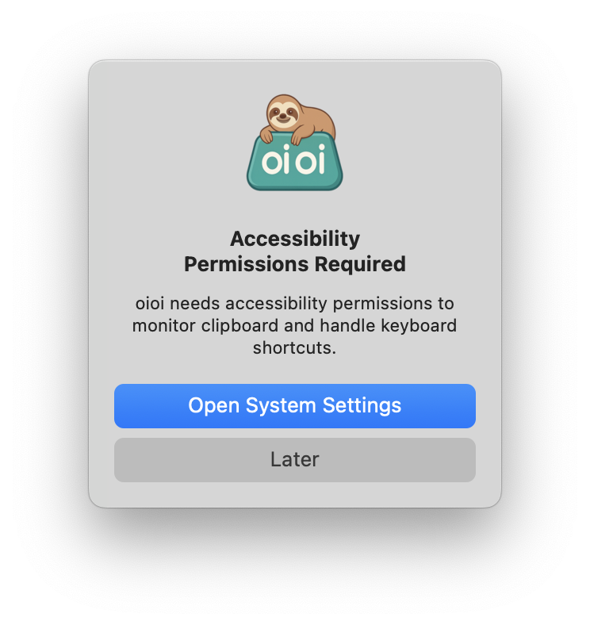

# oioi - macOS 上的免费剪贴板管理器
<div>
  <p align="center">
     
  </p>
</div>


## 功能特点 ✨
 <p align="center">
</a>
</p>

*无需注册 - 下载即可使用！*
- 🆓 100% 免费 (无需账户) 
- 📋 剪贴板历史管理
- ⌨️ 键盘快捷键支持
- 🏷️ 按日期/类别组织
- 复制内容的时光机。


---

<div align="center">
   
  <h1>oioi 安装</h1>
</div>

### 简单安装
  

1. 直接从[链接](https://github.com/vishesh9131/oioi/releases/download/1.0/oioi_installer.dmg)下载 oioi_installer.dmg
2. 从上面的链接您将能够下载 `oioi_installer.dmg`
3. 双击挂载或右键点击"使用磁盘映像挂载器打开"

---

## 首次运行设置 🔐
  

1. 在桌面或 Finder 侧边栏位置选项卡中，您可以看到 oioi。
2. 点击它

---

## 安装窗口
  
1. 您可以看到此窗口，如果没有看到，请再次点击 oioi 磁盘...

---


## 拖拽!!
  

- 将其拖到应用程序文件夹。
- 等待 10 秒钟，然后安全关闭此窗口。

---

## 搜索 oioi
  

- 现在通过启动台启动它

---

## 信任 oioi
  
- 将出现此弹窗。
- 点击打开系统设置
- 这是基本的辅助功能权限，用于监听您的 MacBook 快捷键。
- (如果需要，也可以弹出挂载的磁盘)
---

## 信任 oioi 2
  
  


- 勾选辅助功能权限。

---

## 使用 oioi
  

1. 在后台自动运行
2. 默认快捷键（可配置）：
   - `⌥ + V`：显示剪贴板历史

---

## 使用 oioi 提高生产力
  

此外，从上方菜单栏，您可以时间旅行您的剪贴板。


## 卸载 oioi 🗑️
1. 从菜单栏退出 oioi
2. 从应用程序文件夹拖到垃圾桶
3. 删除数据文件夹：
   ```bash
   rm -rf ~/Library/Application\ Support/oioi
   ```

---

## 支持 ❓
如需帮助，请查看：
- 作者：@vishesh9131 
- [GitHub Issues](https://github.com/vishesh9131/oioi/issues)
- 电子邮件：sciencely98@gmail.com

---

📌 *注意：需要 macOS 10.14 或更高版本*  
⭐ *如果您喜欢 oioi，请为我们的 GitHub 仓库点星！* 