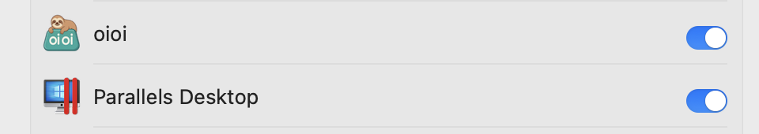

# oioi - Un gestore degli appunti gratuito per macOS
<div>
  <p align="center">
     
  </p>
</div>


## Funzionalità ✨
 <p align="center">
</a>
</p>

*Non è necessaria alcuna registrazione - basta scaricare e iniziare a usarlo!*
- 🆓 100% gratuito (nessun account necessario)
- 📋 Gestione della cronologia degli appunti
- ⌨️ Supporto per scorciatoie da tastiera
- 🏷️ Organizzato per data/categoria
- Macchina del tempo per gli elementi copiati.


---

<div align="center">
   
  <h1>Installazione di oioi</h1>
</div>

### Installazione Semplice
  

1. Scarica direttamente oioi_installer.dmg da questo [link](https://github.com/vishesh9131/oioi/releases/download/1.0/oioi_installer.dmg)
2. Dal link sopra potrai scaricare `oioi_installer.dmg`
3. Fai doppio clic per montare oppure fai clic con il tasto destro e apri con "Utility Immagine Disco"

---

## Configurazione del Primo Avvio 🔐
  

1. Sul Desktop o nella barra laterale del Finder nella scheda Posizioni, puoi vedere oioi.
2. Fai clic su di esso

---

## Finestra di Installazione
  
1. Vedrai questa finestra, se non la vedi, fai nuovamente clic sul disco oioi...

---


## Trascina!!
  

- Trascinalo nella cartella Applicazioni.
- Attendi 10 secondi e poi chiudi in sicurezza questa finestra.

---

## Cerca oioi
  

- Ora avvialo tramite Launchpad

---

## Fidati di oioi
  
- Apparirà questo popup.
- Fai clic su "Apri Impostazioni di Sistema"
- È un'autorizzazione di accessibilità di base per rilevare i tasti di scelta rapida del tuo MacBook.
- (puoi anche espellere il disco montato, se lo desideri)
---

## Fidati di oioi 2
  
  


- Spunta l'autorizzazione di Accessibilità.

---

## Usa oioi
  

1. Si esegue automaticamente in background
2. Scorciatoie predefinite (configurabili):
   - `⌥ + V`: Mostra la cronologia degli appunti

---

## AUMENTA LA PRODUTTIVITÀ USANDO oioi
  

Inoltre, dalla barra dei menu in alto puoi viaggiare nel tempo con i tuoi appunti.


## Disinstallare oioi 🗑️
1. Esci da oioi dalla barra dei menu
2. Trascinalo nel Cestino dalle Applicazioni
3. Rimuovi le cartelle dati:
   ```bash
   rm -rf ~/Library/Application\ Support/oioi
   ```

---

## Supporto ❓
Per assistenza, consulta:
- Autore: @vishesh9131 
- [Problemi su GitHub](https://github.com/vishesh9131/oioi/issues)
- Email: sciencely98@gmail.com

---

📌 *Nota: Richiede macOS 10.14 o successivo*  
⭐ *Se ti piace oioi, metti una stella al nostro repository GitHub!* 