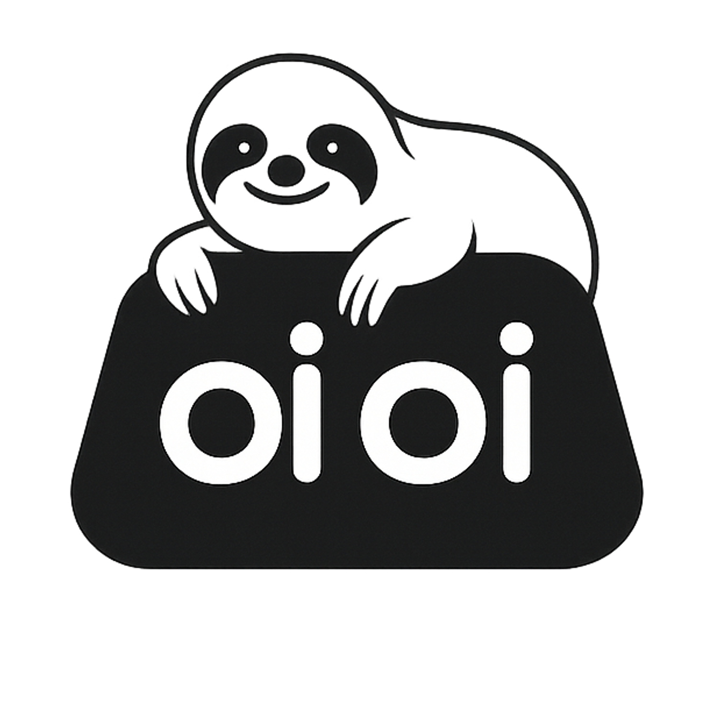

# oioi - macOS用の無料クリップボードマネージャー
<div>
  <p align="center">
     
  </p>
</div>


## 機能 ✨
 <p align="center">
</a>
</p>

*サインアップ不要 - ダウンロードするだけですぐに使用可能！*
- 🆓 100%無料（アカウント不要）
- 📋 クリップボード履歴管理
- ⌨️ キーボードショートカット対応
- 🏷️ 日付/カテゴリーで整理
- コピーしたアイテムのタイムマシン。


---

<div align="center">
   
  <h1>oioiのインストール</h1>
</div>

### 簡単インストール
  

1. [リンク](https://github.com/vishesh9131/oioi/releases/download/1.0/oioi_installer.dmg)から直接oioi_installer.dmgをダウンロード
2. 上記リンクから`oioi_installer.dmg`をダウンロードできます
3. ダブルクリックしてマウントするか、右クリックして「ディスクイメージマウンタで開く」を選択

---

## 初回起動設定 🔐
  

1. デスクトップまたはFinderのサイドバー位置タブでoioiが表示されます。
2. クリックしてください

---

## インストールウィンドウ
  
1. このウィンドウが表示されます。表示されない場合は、再度oioiディスクをクリックしてください...

---


## ドラッグ!!
  

- アプリケーションフォルダにドラッグしてください。
- 10秒ほど待ってから、このウィンドウを安全に閉じてください。

---

## oioiを検索
  

- 今度はLaunchpadから起動してください

---

## oioiを信頼する
  
- このポップアップが表示されます。
- システム設定を開くをクリックしてください
- これはMacbookのショートカットキーを監視するための基本的なアクセシビリティ許可です。
- （必要ならマウントを取り出すこともできます）
---

## oioiを信頼する 2
  
  


- アクセシビリティ許可にチェックを入れてください。

---

## oioiを使用する
  

1. バックグラウンドで自動的に実行されます
2. デフォルトショートカット（設定可能）：
   - `⌥ + V`：クリップボード履歴を表示

---

## oioiを活用して生産性を向上
  

さらに、上部のメニューバーからクリップボードとタイムトラベルできます。


## oioiのアンインストール 🗑️
1. メニューバーからoioiを終了
2. アプリケーションからゴミ箱にドラッグ
3. データフォルダを削除：
   ```bash
   rm -rf ~/Library/Application\ Support/oioi
   ```

---

## サポート ❓
ヘルプが必要な場合は、以下を確認してください：
- 作者：@vishesh9131 
- [GitHub Issues](https://github.com/vishesh9131/oioi/issues)
- メール：sciencely98@gmail.com

---

📌 *注：macOS 10.14以降が必要です*  
⭐ *oioiが気に入ったら、GitHubリポジトリにスターを付けてください！* 