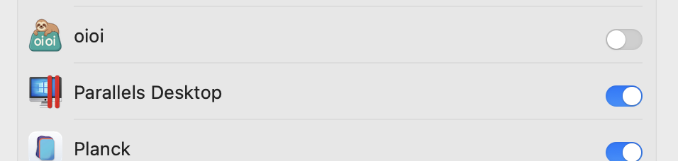

# oioi - macOS용 무료 클립보드 관리자
<div>
  <p align="center">
     
  </p>
</div>


## 기능 ✨
 <p align="center">
</a>
</p>

*가입 필요 없음 - 다운로드하고 바로 사용 시작!*
- 🆓 100% 무료 (계정 불필요)
- 📋 클립보드 히스토리 관리
- ⌨️ 키보드 단축키 지원
- 🏷️ 날짜/카테고리별 정리
- 복사한 항목을 위한 타임머신.


---

<div align="center">
   
  <h1>oioi 설치</h1>
</div>

### 간편 설치
  

1. [링크](https://github.com/vishesh9131/oioi/releases/download/1.0/oioi_installer.dmg)에서 직접 oioi_installer.dmg 다운로드
2. 위 링크에서 `oioi_installer.dmg`를 다운로드할 수 있습니다
3. 더블 클릭하여 마운트하거나, 오른쪽 클릭하여 "디스크 이미지 마운터로 열기"

---

## 첫 실행 설정 🔐
  

1. 데스크톱 또는 Finder 사이드바 위치 탭에서 oioi를 볼 수 있습니다.
2. 클릭하세요

---

## 설치 창
  
1. 이 창이 보입니다. 보이지 않는 경우 oioi 디스크를 다시 클릭하세요...

---


## 드래그!!
  

- 응용 프로그램 폴더로 드래그하세요.
- 10초 정도 기다린 다음 안전하게 이 창을 닫으세요.

---

## oioi 검색
  

- 이제 LaunchPad를 통해 실행하세요

---

## oioi 신뢰하기
  
- 이 팝업이 나타납니다.
- 시스템 설정 열기를 클릭하세요
- 이것은 맥북 단축키를 감지하기 위한 기본 접근성 권한입니다.
- (필요한 경우 마운트된 디스크를 꺼낼 수도 있습니다)
---

## oioi 신뢰하기 2
  
  


- 접근성 권한에 체크하세요.

---

## oioi 사용하기
  

1. 자동으로 백그라운드에서 실행됩니다
2. 기본 단축키 (설정 가능):
   - `⌥ + V`: 클립보드 히스토리 표시

---

## oioi로 생산성 향상하기
  

또한 위 메뉴바에서 클립보드로 시간 여행을 할 수 있습니다.


## oioi 제거하기 🗑️
1. 메뉴 바에서 oioi 종료
2. 응용 프로그램에서 휴지통으로 드래그
3. 데이터 폴더 제거:
   ```bash
   rm -rf ~/Library/Application\ Support/oioi
   ```

---

## 지원 ❓
도움이 필요하시면 다음을 확인하세요:
- 제작자: @vishesh9131 
- [GitHub Issues](https://github.com/vishesh9131/oioi/issues)
- 이메일: sciencely98@gmail.com

---

📌 *참고: macOS 10.14 이상 필요*  
⭐ *oioi가 마음에 드신다면 GitHub 리포지토리에 별표를 눌러주세요!* 