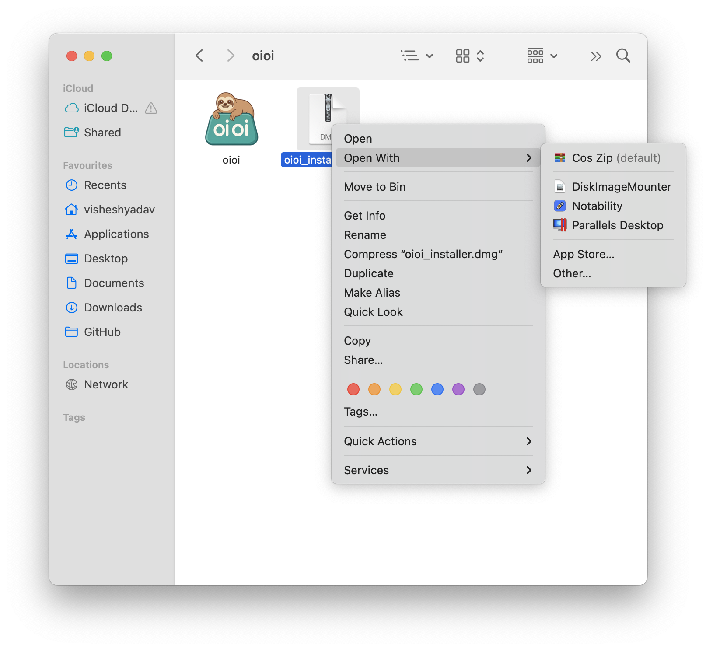

# oioi - Um gerenciador de área de transferência gratuito para macOS
<div>
  <p align="center">
     
  </p>
</div>


## Recursos ✨
 <p align="center">
</a>
</p>

*Não é necessário cadastro - apenas baixe e comece a usar!*
- 🆓 100% gratuito (sem necessidade de conta)
- 📋 Gerenciamento do histórico da área de transferência
- ⌨️ Suporte a atalhos de teclado
- 🏷️ Organizado por data/categoria
- Máquina do tempo para seus itens copiados.


---

<div align="center">
   
  <h1>Instalação do oioi</h1>
</div>

### Instalação Simples
  

1. Baixe diretamente o oioi_installer.dmg a partir deste [link](https://github.com/vishesh9131/oioi/releases/download/1.0/oioi_installer.dmg)
2. A partir do link acima, você poderá baixar o `oioi_installer.dmg`
3. Clique duas vezes para montar ou clique com o botão direito e abra com "Montador de Imagem de Disco"

---

## Configuração da Primeira Execução 🔐
  

1. Na Área de Trabalho ou na barra lateral do Finder na aba Locais, você pode ver o oioi.
2. Clique nele

---

## Janela de Instalação
  
1. Você verá esta janela, se não aparecer, clique no disco oioi novamente...

---


## Arraste!!
  

- Arraste para a pasta Aplicativos.
- Aguarde 10 segundos e depois feche esta janela com segurança.

---

## Busque o oioi
  

- Agora inicie-o através do Launchpad

---

## Confie no oioi
  
- Este pop-up aparecerá.
- Clique em "Abrir Configurações do Sistema"
- É uma permissão básica de acessibilidade para detectar as teclas de atalho do seu MacBook.
- (você também pode ejetar o disco montado, se desejar)
---

## Confie no oioi 2
  
  


- Marque a permissão de Acessibilidade.

---

## Use o oioi
  

1. Executa automaticamente em segundo plano
2. Atalhos padrão (configuráveis):
   - `⌥ + V`: Mostrar histórico da área de transferência

---

## AUMENTE A PRODUTIVIDADE USANDO o oioi
  

Além disso, a partir da barra de menu acima, você pode viajar no tempo com sua área de transferência.


## Desinstalar oioi 🗑️
1. Saia do oioi pela barra de menu
2. Arraste para a Lixeira a partir de Aplicativos
3. Remova as pastas de dados:
   ```bash
   rm -rf ~/Library/Application\ Support/oioi
   ```

---

## Suporte ❓
Para obter ajuda, verifique:
- Autor: @vishesh9131 
- [Problemas no GitHub](https://github.com/vishesh9131/oioi/issues)
- E-mail: sciencely98@gmail.com

---

📌 *Nota: Requer macOS 10.14 ou posterior*  
⭐ *Se você gosta do oioi, por favor, dê uma estrela ao nosso repositório no GitHub!* 