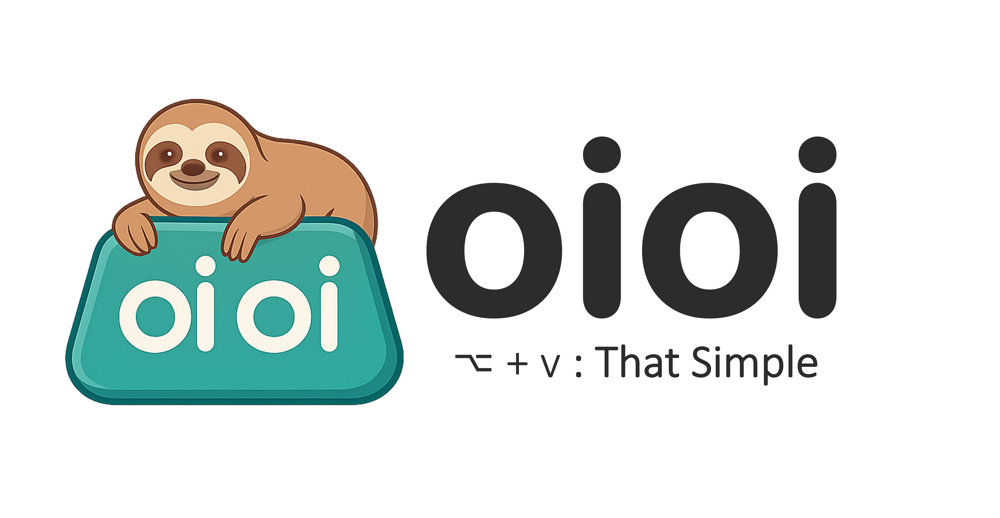
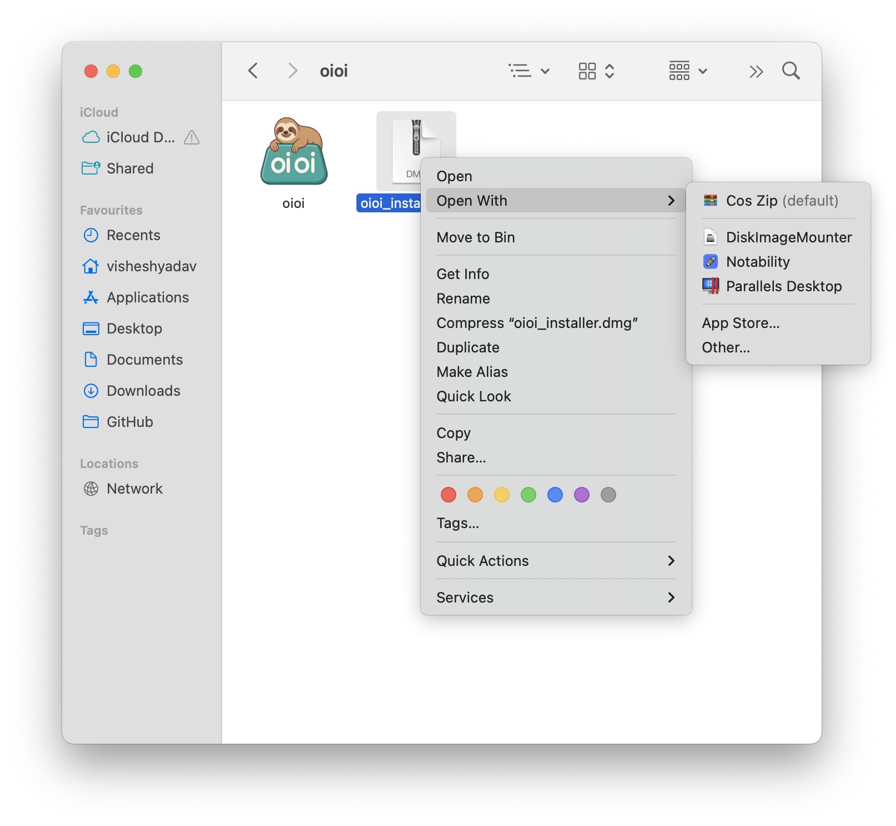
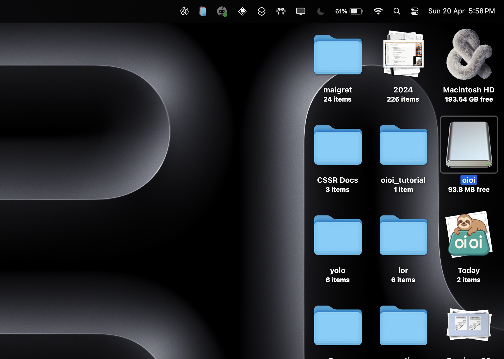
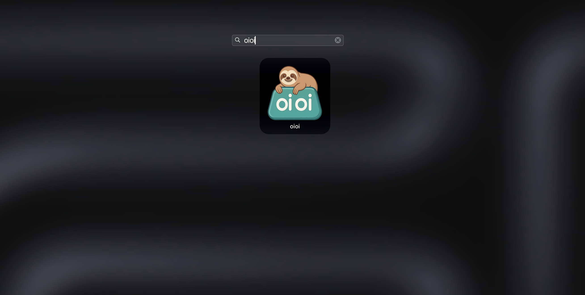
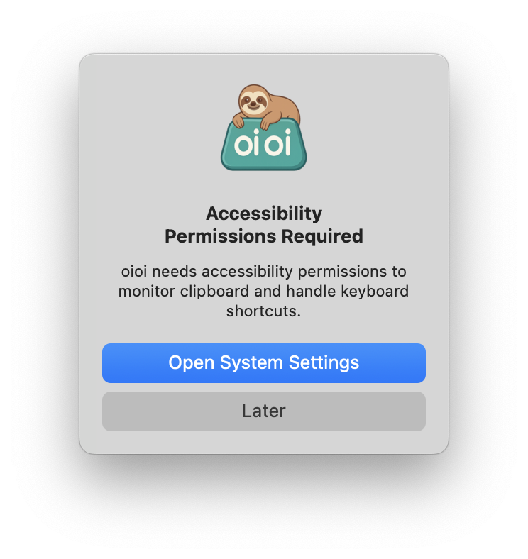
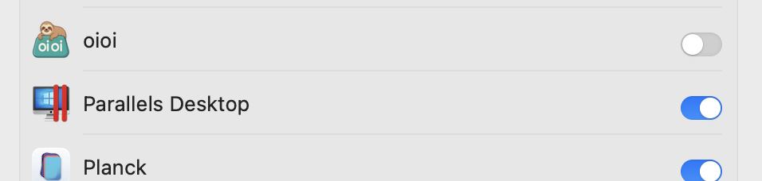
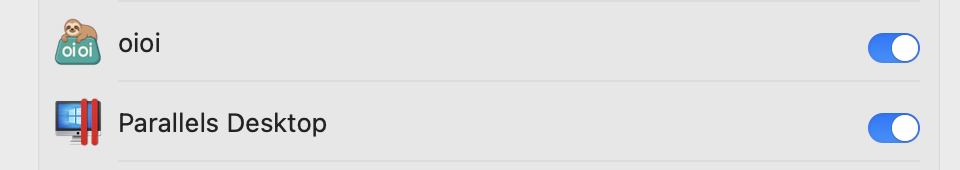

# oioi - Бесплатный менеджер буфера обмена для macOS
<div>
  <p align="center">
     
  </p>
</div>


## Возможности ✨
 <p align="center">
</a>
</p>

*Регистрация не требуется - просто скачайте и начните использовать!*
- 🆓 100% бесплатно (учетная запись не требуется)
- 📋 Управление историей буфера обмена
- ⌨️ Поддержка горячих клавиш
- 🏷️ Организация по дате/категории
- Машина времени для скопированных элементов.


---

<div align="center">
   
  <h1>Установка oioi</h1>
</div>

### Простая установка
  

1. Скачайте oioi_installer.dmg напрямую по [ссылке](https://github.com/vishesh9131/oioi/releases/download/1.0/oioi_installer.dmg)
2. По ссылке выше вы сможете скачать `oioi_installer.dmg`
3. Дважды щелкните для монтирования или щелкните правой кнопкой мыши и откройте с помощью "DiskImageMounter"

---

## Настройка при первом запуске 🔐
  

1. На рабочем столе или в боковой панели Finder на вкладке Размещение вы увидите oioi.
2. Нажмите на него

---

## Окно установки
  
1. Вы увидите это окно, если не видите, снова нажмите на диск oioi...

---


## Перетащите!!
  

- Перетащите в папку Приложения.
- Подождите 10 секунд, затем безопасно закройте это окно.

---

## Найдите oioi
  

- Теперь запустите его через Launchpad

---

## Доверьтесь oioi
  
- Появится это всплывающее окно.
- Нажмите "Открыть настройки системы"
- Это базовое разрешение на доступ к специальным возможностям для прослушивания горячих клавиш вашего MacBook.
- (при желании также можно извлечь смонтированный диск)
---

## Доверьтесь oioi 2
  
  


- Установите флажок разрешения доступа к специальным возможностям.

---

## Используйте oioi
  

1. Автоматически работает в фоновом режиме
2. Стандартные горячие клавиши (настраиваемые):
   - `⌥ + V`: Показать историю буфера обмена

---

## ПОВЫСЬТЕ ПРОДУКТИВНОСТЬ С ПОМОЩЬЮ oioi
  

Кроме того, через меню в верхней части экрана вы можете путешествовать во времени с вашим буфером обмена.


## Удаление oioi 🗑️
1. Выйдите из oioi через строку меню
2. Перетащите в Корзину из папки Приложения
3. Удалите папки с данными:
   ```bash
   rm -rf ~/Library/Application\ Support/oioi
   ```

---

## Поддержка ❓
За помощью обращайтесь:
- Автор: @vishesh9131 
- [GitHub Issues](https://github.com/vishesh9131/oioi/issues)
- Электронная почта: sciencely98@gmail.com

---

📌 *Примечание: Требуется macOS 10.14 или новее*  
⭐ *Если вам нравится oioi, поставьте звезду нашему репозиторию на GitHub!* 