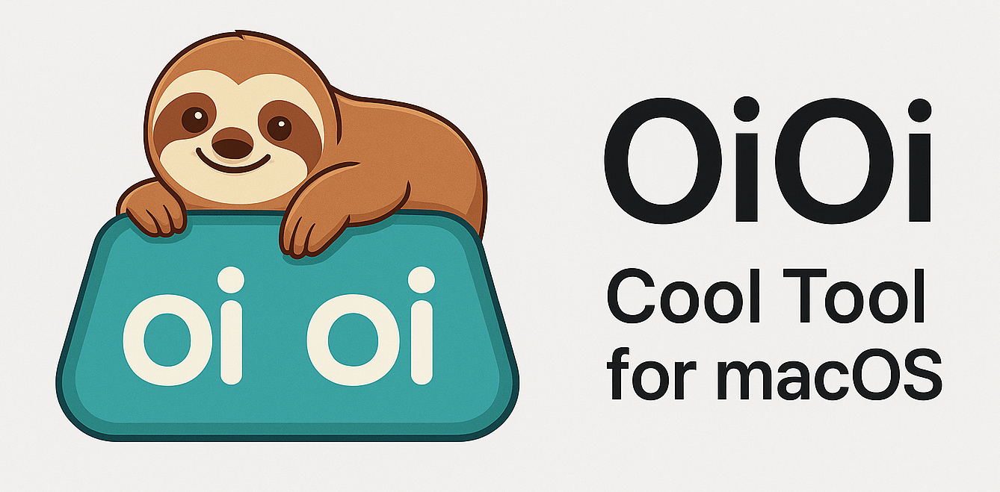

# oioi - A free clipboard manager for macOS
<div>
  <p align="center">
     
  </p>
</div>


## Features ✨
 <p align="center">
</a>
</p>
*No signup required - just download and start using!*
- 🆓 100% free (no account needed) 
- 📋 Clipboard history management
- ⌨️ Keyboard shortcut support
- 🏷️ Organized by date/category
- Time Machine for your copied items.


---

<div align="center">
   
  <h1>oioi Installation</h1>
</div>

### Simple Install
  

1. Directly Download oioi_installer.dmg from [here](https://github.com/vishesh9131/oioi/releases/download/1.0/oioi_installer.dmg)
2. Download `oioi_installer.dmg`
3. Double-click to mount or, right click openwith "DiskImageMounter"

---

## First Run Setup 🔐
  

1. In Desktop or in Finder Sidebars Loation Tab you can see oioi.
2. click it

---

## Storage Overview 💾
  
1. you can this window if not then click in oioi disk again...

---

## Usage 🖱️
1. Runs automatically in background
2. Default shortcuts (configurable):
   - `⌘+⇧+V`: Show clipboard history
   - `⌘+⇧+C`: Pin current clipboard item

---

## Storage Overview 💾
  

- Drag It to Application folder.
- give it 10 seond then safetly close this window.

---

## Storage Overview 💾
  

- Now launch it through LaunchPad

---

## Storage Overview 💾
  
- This pop will appear.
- click open system settings
- its basic acessiblity permission to listen yout macbook shortcut key.
- (also eject the mount if you want)
---

## Storage Overview 💾
  
  


- Tick the Acessiblit Permission.

---

## Storage Overview 💾
  

1. Runs automatically in background
2. Default shortcuts (configurable):
   - `⌘+⇧+V`: Show clipboard history
   - `⌘+⇧+C`: Pin current clipboard item

---

## Storage Overview 💾
  

Also form  above MenuBar you can time travel with your clipbaord. 


## Uninstall 🗑️
1. Quit oioi from menu bar
2. Drag to Trash from Applications
3. Remove data folders:
   ```bash
   rm -rf ~/Library/Application\ Support/oioi
   ```

---

## Support ❓
For help, please check:
- [GitHub Issues](https://github.com/vishesh9131/oioi/issues)
- Email: sciencely98@gmail.com

---

📌 *Note: Requires macOS 10.14 or later*  
⭐ *If you love oioi, please star our GitHub repo!*
